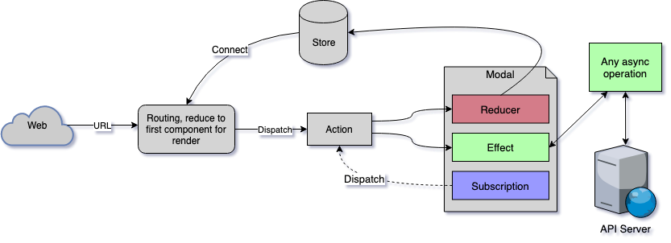
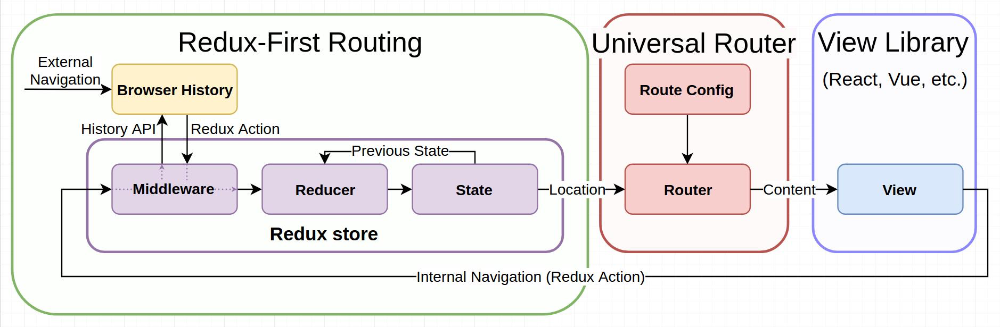

This is an attempt to create an opiniated starter based on [CRA](https://github.com/facebook/create-react-app) with [Redux](https://redux.js.org/), [Redux-saga](https://redux-saga.js.org/). 

Lets first clarify about the word saga. This is the term used in refrence to [CQRS](https://martinfowler.com/bliki/CQRS.html) i.e. **Command Query Responsibility Segregation**.  Saga is the code that coordinates and routes messages between bounded contexts and aggregates.

To break it down in React-Redux context, it is like a *process manager*. Originally it was presented in "[Saga](http://www.cs.cornell.edu/andru/cs711/2002fa/reading/sagas.pdf)" paper.

###What exactly we intend to use Saga for?

We will use redux-saga to wire up our application state store with batteries which will help us do async tasks such as API calls. The state generated from these tasks will drive the UI renders. This is a ***data driven*** approach. 

The overall flow is shown below.

The routing solution is implemented with the help of  `universal-router` + `redux-first-routing` used to create a complete Redux routing solution for any front-end framework/library. 

### What else this starter provides out of box?

1.  Adds the eslint and prettier for code formatting. 

2. Adds the CSS preprocessor and scss compiler. 

3. Does environment config setup.  

4. Utility libraries - lodash-es, moment, normalizr, bootstrap, js-cookie. 

5. Adds reactstrap for react bootstrap components. 

6. Adds the testing framework. 

7. Adds internationalization support 

